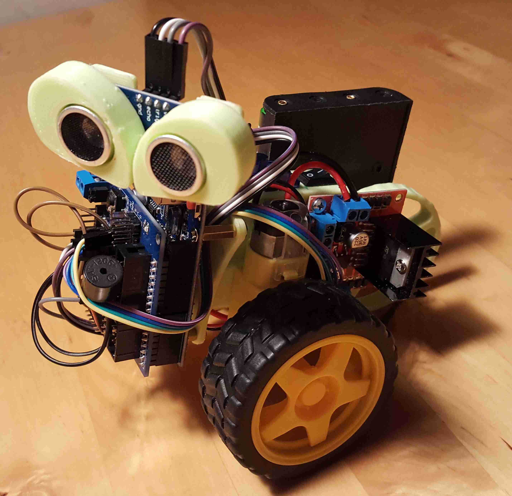

# Scru-FE

Hier sind alle Informationen zum Projekt Scru-FE hinterlegt.

### Einleitung 
Diese Projekt ist ursprünglich von Ryan Theiss im Jahre 2015 entstanden.
Informationen unter http://www.ZExtrude.com

Das Projekt wurde angepasst und erweitert. Es bietet die Grundlage, um Jugendlichen den Umgang mit Microcontrollern, Elektronischen Komponenten und deren Programmierung beizubringen.
Es wird in detaillierten Schritten gelernt, wie die Baugruppen funktionieren und diese Programmtechnisch angesprochen werden können.
 

## Verzeichnisstruktur
* Pics enthält Bilder
* Code enthält den Sketch für Arduino
* Docs enthält die Unterlagen für Schulungen
* Stl enthält die 3D Druckdaten im .stl Format und als Sketchup Dateien

## Video

## To DO:
* Erstellen von Schulungsunterlagen
* Codeaufbau strukturiert aufbauen
* Anleitung für die Montage der Bauteile
* Stromlaufplan

## ChangeLog

### 0.1 (2017-10-20)
* (Eisbaeeer)
* inital version
### 0.2 (2017-10-24)
* (Eisbaeeer)
* fixed routines in edges